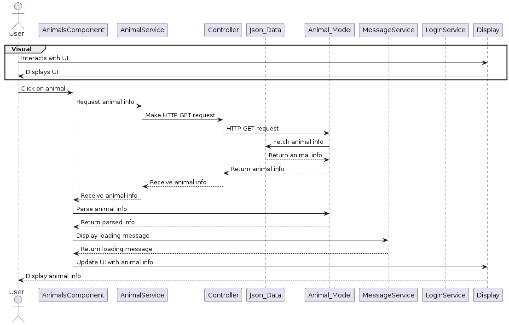
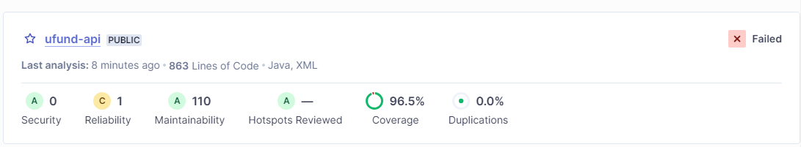

# PROJECT Design Documentation

05 Team Information
* Team name: Team5
* Team members
  * Matthew Gleich
  * Kody Rogers kjr1303
  * Aiden Bewley ajb7163
  * Rited Das rcd8710
  * Catalina Dinozo csd5164

## Executive Summary
  This is the online application for an animal shelter which allows users to choose and checkout their choices from a wide array of pets.
  Users will log in to the application and have categories of pets to look into while also being able to search for one with more specific terms.
  The animal shelter will then allow virtual checkout of the pet while offering vital recources such as animal responsibility training. Users will also
  be able to find details regarding the pets in the application to help them find which pet they want.
 
  

### Purpose
  Users get to choose and adopt animals from the shelter.

### Glossary and Acronyms

| Term | Definition |
|------|------------|
| SPA | Single Page |

## Requirements
The requirements our team focuses on centers around providing a simple yet effective way to allow users to checkout and adopt pets of their choosing.

Upon logging in, users are greeted with a navigation page presenting broad categories of animals, such as dogs, cats, and fish, each clickable to reveal available breeds. 

Clicking on a breed leads to a page showcasing individual animals ready for adoption, complete with details like name, age.. 

A search bar allows users to quickly find specific animals or narrow down their options. Once users find a potential pet, they can initiate the adoption process through a straightforward checkout procedure, which may involve filling out an application and scheduling a visit. 

Additionally, the website provides valuable resources and information about pet care and training. Accessibility features ensure all users can easily navigate the site, while clear instructions and support options are available for those needing assistance.

### Definition of MVP
The Minimum Viable Product (MVP) for the animal shelter website comprises a simple interface enabling users to browse available animals by categories like dogs, cats, and fish. Users can view basic information about individual animals, such as name, breed, and age. A search feature allows for quick searches based on specific criteria. The checkout process allows users to express interest in adopting animals, providing contact information for further communication with the shelter.

### MVP Features

Login/Logout:
As a User I want to login so that I can modify a shopping cart.

Pet Search:
As a user I want to have a way to search for a pet by name or id so I can locate a specific one.

View Available Pets:
As a customer I want to be able to view the pets that are available at the shelter so that I can buy it.

Checkout:
As a customer I want to CHECKOUT so that I can adopt a pet.

Basket adding/removing:
As a customer I want to be able to add and remove pets from a basket so that I can adopt a pet.

### Enhancements

Pet Care:
As a User I want to Watch this Resources so that I can use the pet care training process

Progress Bar:
As a Customer I want to View Progress Bar so that I can see the amount of animals sold.

## Application Domain

The domain demonstrates that Managers, helpers, and users can login to the application, managers can manage the cupboard of needs while helpers can veiw the cupboard. 

Helpers can then search for needs(an examaple being to have animals be adopted from the shelter) to add, remove, or checkout to the funding basket. The domain also shows that the user can interact with additional features on the application such as educational recourses. Finally, progress in the animal shelters set goals of animal adoption can be demonstrated by the progress bar feature.

## Architecture and Design

This section describes the application architecture.

### Summary

The following Tiers/Layers model shows a high-level view of the webapp's architecture. 

The web application, is built using the Model–View–ViewModel (MVVM) architecture pattern. 

The Model stores the application data objects including any functionality to provide persistance. 

The View is the client-side SPA built with Angular utilizing HTML, CSS and TypeScript. The ViewModel provides RESTful APIs to the client (View) as well as any logic required to manipulate the data objects from the Model.

Both the ViewModel and Model are built using Java and Spring Framework. Details of the components within these tiers are supplied below.

The View Model Controller is made up of the AnimalController, TransactionController and User Controller. 

On the other hand, the Model has two componenets, the model and persistence. The model is made up of Animal, Transacion, and User.

The persistence is made up of the AnimalDAO and AnimalFileDAO.

### Overview of User Interface

This section describes the web interface flow; this is how the user views and interacts with the web application.

The user interface (UI) of the application is designed to be intuitive and user-friendly, comprising various components such as login pages, dashboards, animal listings, search bars, and detailed animal profiles. 

Role-based access control ensures that users only have access to features relevant to their role, promoting security and usability.
  
  

  The UI guides users through the adoption process, from browsing available animals to initiating adoption procedures and accessing educational resources.

  The user flow within the web application typically starts with accessing the login page, where users input their credentials to authenticate. 
  
  Upon successful login, users are directed to the dashboard, offering an overview of available features and pertinent information. From the dashboard, users can navigate to the animals list page to view existing animal records. 
  
  They can use the search bar to find specific animals based on criteria like name or type. 
  
  If authorized, users can access the add animal page to input details about new animals. 
  
  Furthermore, users can click on individual animal entries to access detailed information about them. 
  
  Throughout the flow, users have the flexibility to move back to previous pages or explore other functionalities, ensuring a fluid and user-friendly experience.

### View Tier
The view tier is comprised of many componenets representing the flow in which the user can interact with the application. 

These componenets are login, basket, dashboard, and animals in which the user sees near the header. 

Other than this,  there are visualizations of animal information, a progress bar and the checkout basket. 

The sequence diagrams below describe how the user interacts both with the visual of the application as well as what occurs within the application to demonstrate these visuals.

The sequence that takes place during login

Finally, when the user goes to the animal page, they are greeted with several animals, the sequence diagram below demonstrates what happens when the user clicks on these animals in order to get information on one of them

Overall, the view tier allows the user to interact with features through actions like clicking or searching, this calls functions in the component's typescript files that utilize model, viewmodel
interaction to get information.
### ViewModel Tier

 The AnimalController class is a key component in a Spring MVC application designed to handle REST API requests related to animal resources. Annotated with @RestController, it signifies its role as a controller for managing HTTP requests and producing JSON responses. 
 
 The constructor's dependency injection of an AnimalDAO instance establishes loose coupling with the underlying data access layer. 
 
 The class encompasses methods to handle various HTTP methods, such as GET, POST, PUT, and DELETE, each responsible for distinct CRUD operations on animal entities. 

 
 
 The methods return ResponseEntity objects, encapsulating the HTTP response along with the relevant animal data or status codes. 
 
 By facilitating communication between clients and the data access layer, the AnimalController encapsulates the application's business logic, adhering to the principles of the Spring framework and promoting maintainability and modularity.

  The class diagram showcases  the controllers interactions with the model. As seen, both the Animal and AnimalDAO classes derive from the AnimalController and the data it provides.

  This tier of the architecture comprises three Spring REST API controllers: AnimalController, TransactionController, and UserController. 

  Each controller handles different resources: Animal, Transaction, and User, respectively. 

  The AnimalController handles CRUD operations for animals, including searching animals by name and type, validating sold animals, creating, updating, and deleting animals. 

  The TransactionController manages transactions, specifically handling GET requests for all transactions. 

  The UserController deals with user-related operations such as retrieving all users, getting a user by name, creating, updating, and performing checkout operations.

  Each controller utilizes Spring annotations for mapping HTTP requests to appropriate handler methods. Additionally, they incorporate logging functionalities to log relevant information.

### Model Tier

  The Animal class encapsulates the data model for representing animal entities within the application. 
  
  We defines fields to represent various attributes of animals such as ID, name, type, breed, sex, age, and cost, and provides methods to access and modify these attributes. 
  
  Utilizing the @JsonProperty annotation ensures seamless serialization and deserialization of JSON objects to Java objects, facilitating data exchange between the application and external systems. 
  
  With a constructor for initializing Animal objects and getter/setter methods for accessing/modifying attributes, the class ensures data integrity and encapsulation. 
  
  Additionally, the overridden toString() method provides a formatted string representation of an Animal object, aiding in debugging and logging operations. 

  Our class diagram for the model allows helps with understanding of passage of information in the model tier. Notice that our more advanced functions involve information already provided by other class ultimately aiding in code simplicity and program comprehensiveness. 

  The persistence tier of the system is defined by the AnimalDAO interface and its implementation AnimalFileDAO. 
  
  The interface specifies methods for interacting with the data storage related to animals, users, transactions, and their respective CRUD operations. 
  
  The AnimalFileDAO class implements these methods to provide functionality for JSON file-based persistence for animals, users, and transactions. 
  
  It utilizes a TreeMap to cache animal objects, enabling efficient retrieval and manipulation operations. Additionally, it leverages the Jackson ObjectMapper for serialization and deserialization between Java objects and JSON format. 
  
  The class ensures thread safety with synchronized blocks and handles file operations for reading and writing data. Methods such as checkout facilitate transaction processing, while others like createUser and createAnimal support entity creation. 
  
  Overall, this tier encapsulates data access logic and file management, facilitating seamless interaction with the underlying data storage.

## OO Design Principles

  While develooping the application, Several Object Oriented Design Principles were considered, starting off, we use single responsibility principle:
 
  View:the Single Responsibility Principle (SRP) is evident in the distinct roles assigned to various components. For instance, the AnimalDetailComponent is responsible for displaying detailed information about a specific animal, while the AnimalsComponent manages the display of a list of animals. Similarly, the DashboardComponent focuses on presenting a summarized view of animal data, and the LoginComponent handles user authentication. Each component encapsulates specific functionalities related to its purpose, ensuring that it has a single reason to change. In the Angular frontend, components such as LoginComponent and AnimalsComponent handle specific user interactions related to login and animal management, respectively. They delegate data retrieval and manipulation tasks to services like LoginService and AnimalService, maintaining a clear separation of concerns. Similarly, in the backend Java code, classes like AnimalFileDAO are responsible for data persistence operations related to animals, while LoginService handles user authentication and authorization. This modular design allows for easier maintenance, testing, and future enhancements, as changes in one area are less likely to affect other parts of the system.
  
  Controller:
  In thev controller code, the Single Responsibility Principle (SRP) is applied by ensuring that each method in the AnimalController class handles a specific type of HTTP request related to the Animal resource. For example, the getAnimal method retrieves an animal by its ID, the getAnimals method retrieves all animals, the searchAnimals method searches for animals based on a provided name, and so on. Each method is responsible for handling only one type of request and performs a specific action related to that request, adhering to the SRP. Additionally, the controller class itself is responsible for mapping these HTTP requests to the appropriate methods, further reinforcing the SRP principle by separating concerns related to request handling from business logic or data access concerns.

  Model: 
  The Animal class represents the attributes and behavior of an animal entity. It defines the structure of an animal, including its properties such as name, type, breed, sex, age, and cost. The class also includes methods for accessing and modifying these properties. By encapsulating the attributes and behaviors related to an animal within this class, it adheres to the SRP by focusing solely on modeling the animal entity.The code also exemplifies the Single Responsibility Principle effectively through its distinct separation of concerns within the TransactionController and UserController. Each controller is dedicated to handling HTTP requests related to specific resources—transactions and users, respectively. By delegating data access operations to the AnimalDAO, the controllers maintain a clear separation of concerns, with the DAO responsible for database interactions while the controllers focus solely on request handling and response generation. This architectural design enhances maintainability and readability, as each component has a single, well-defined responsibility, aligning perfectly with the principles of SRP.
  
  Persistence: 
  The AnimalDAO interface defines the contract for performing CRUD (Create, Read, Update, Delete) operations on animal objects. It includes methods such as getAnimals, findAnimals, getAnimal, createAnimal, updateAnimal, and deleteAnimal. This interface specifies the operations that any implementation of a data access object (DAO) for animal persistence should support. By separating the data access logic from the model class, the interface follows the SRP by defining a clear boundary for data persistence operations. The AnimalFileDAO class implements the functionality for persisting animal objects to a JSON file. It includes methods for loading animals from the file, saving animals to the file, and performing CRUD operations using the in-memory representation of animal data. By encapsulating the logic for reading from and writing to a file within this class, it adheres to the SRP by focusing solely on the persistence aspect of animal data management.

  
  

  The visual above helps us notice that the UI components very well demonstrate SRP as they encompass a role each coming together to create the program application
 

  Now, let's discuss Dependency Injection (DI), which is a technique for achieving loose coupling between classes and promoting easier testing and maintainability:

  Controller: Dependency injection is demonstrated through the constructor of each controller class (AnimalController, TransactionController, and UserController). Each controller class requires a dependency of type AnimalDAO to perform various CRUD operations. This dependency is injected into the controller classes via constructor parameters. By relying on Spring's dependency injection mechanism, the controllers remain decoupled from the specific implementation of the AnimalDAO, allowing for easier testing, maintenance, and scalability of the application. Moreover, this design promotes the principle of inversion of control, where the control over the dependencies is shifted from the classes themselves to an external entity (Spring framework), resulting in more modular and flexible code.
  
  Model: The model code showcases dependency injection through the constructor of the Animal, Transaction, and User classes. Dependency injection is evident in the constructors of these classes, where dependencies are injected via parameters. This design approach allows for loose coupling between classes, as dependencies are passed externally rather than being created internally within the class. This facilitates easier testing and maintenance, as dependencies can be easily swapped or mocked. Additionally, the @JsonProperty annotations demonstrate the mapping between JSON objects and Java objects during serialization and deserialization, further enhancing the flexibility and interoperability of the codebase.

  Persistence: In the AnimalFileDAO class, dependency injection is used to inject the filename and ObjectMapper dependencies through the constructor. The @Value annotation is used to inject the filename value from the Spring application properties file. Additionally, the ObjectMapper instance is injected by the Spring container, following the configuration specified in the application context. This approach allows the AnimalFileDAO class to be decoupled from the specific file name and ObjectMapper implementation, facilitating easier configuration and testing.
  
  View:
  In the Angular frontend, components receive services such as AnimalService, LoginService, and MessageService through constructor injection, enabling them to access backend functionality and manage user interactions seamlessly. These services themselves leverage DI to inject dependencies like HttpClient for making HTTP requests. In the backend Java code, classes such as AnimalFileDAO utilize DI to inject dependencies like ObjectMapper, allowing for easy configuration and management of dependencies. This approach fosters loose coupling between components and services, making the application more resilient to changes and facilitating unit testing by enabling the injection of mock objects. Overall, DI plays a pivotal role in ensuring the flexibility, scalability, and maintainability of the application architecture across all tiers.

  Moving on to another design principle, we have the law of Demeter:
  
  View Model:
  The AnimalController class interacts directly with AnimalDAO for database operations related to animals (getAnimal, getAnimals, searchAnimals, etc.). This adheres to the Law of Demeter, as the AnimalController only communicates with its immediate collaborator (AnimalDAO), without needing to know about the internal workings of other classes or objects. Similar to the AnimalController, the TransactionController class interacts only with AnimalDAO for handling transactions related to animal data (getTransactions). It follows the Law of Demeter by maintaining a direct relationship with its immediate collaborator (AnimalDAO) without needing knowledge of other internal components.The UserController class interacts primarily with AnimalDAO for user-related operations (getUsers, getUser, createUser, etc.). This also conforms to the Law of Demeter as it communicates directly with its immediate collaborator (AnimalDAO), keeping the coupling between components low.

  Model: The Law of Demeter is demonstrated by the limited interactions between classes and their immediate collaborators. Each model class (Animal, Transaction, and User) encapsulates its data fields and provides methods solely for accessing and modifying its own attributes. For instance, the Animal class exposes setter and getter methods only for its properties, such as name, type, breed, etc., ensuring that external classes interact with Animal objects through a controlled interface. Similarly, the Transaction and User classes follow the same pattern, maintaining a clear separation of concerns and adhering to the Law of Demeter by limiting direct dependencies and interactions between components. 
  
  Persistence:
  Additionally, Law of Demeter is applied in the AnimalFileDAO class through its method signatures and interactions with other classes. Each method in the AnimalFileDAO interface defines specific actions related to animal persistence, such as retrieving animals, adding transactions, checking out animals, creating users, and updating animals. These methods encapsulate their functionality and only interact with immediate collaborators, such as the User and Transaction classes, to perform their tasks. For instance, the checkout method only interacts with the User class to validate the basket and update user data, adhering to the Law of Demeter by maintaining a clear separation of concerns and limiting dependencies between components. This approach enhances modularity and maintainability by minimizing coupling and promoting encapsulation within the codebase.

  View:
  In the view angular code, the Law of Demeter is employed for loose coupling between components and services. Firstly, both LoginComponent and NeedBasketComponent rely on the LoginService for user authentication and management, achieved through Service Dependency Injection. This approach abstracts away the authentication logic, promoting loose coupling by interacting solely with the LoginService interface rather than its internal implementation. Secondly, Document Object Dependency Injection injects the DOCUMENT token into LoginComponent and AnimalsComponent, allowing access to the DOM without direct manipulation. Encapsulation of Component Logic ensures that LoginComponent and AnimalsComponent delegate responsibilities to injected services (LoginService and AnimalService) without internal manipulation of the DOM or authentication tasks, thus maintaining focused responsibilities within each component. Lastly, Service Method Invocation in LoginComponent and NeedBasketComponent delegates tasks such as attemptSignup and checkout to LoginService, adhering to the principle of least knowledge and promoting loose coupling by interacting solely with the LoginService interface.

  
  Finally we have demonstrate low coupling:

  View Model: Low coupling is exemplified through the separation of concerns and the use of dependency injection. Each controller class (AnimalController, TransactionController, and UserController) focuses on handling requests related to a specific resource (Animal, Transaction, and User, respectively). These controllers depend on the AnimalDAO interface, which abstracts away the details of data access. By injecting the AnimalDAO dependency into the controllers' constructors, the controllers remain decoupled from specific implementations of data access. This design allows for flexibility and maintainability, as the controllers can easily switch between different implementations of the AnimalDAO interface without requiring changes to their code. Additionally, the use of interfaces promotes low coupling by defining contracts between components, rather than relying on concrete implementations. 

  Model & Persistence: Low coupling can be observed between the Animal, Transaction, User, and AnimalDAO classes. Each class encapsulates a specific set of functionalities related to its domain, and they interact with each other through well-defined interfaces rather than directly referencing each other's implementations. For instance, the Animal class represents animal entities and contains methods to manipulate animal data. Similarly, the Transaction class represents transaction entities, and the User class represents user entities, each with their own set of methods for handling data related to transactions and users, respectively.

  The AnimalDAO interface defines a contract for data access operations related to animals, such as retrieving, creating, updating, and deleting animal data. This interface serves as a bridge between the model tier and the persistence tier, allowing different implementations of data access logic while keeping the model tier decoupled from specific persistence mechanisms.

  Furthermore, the use of dependency injection (DI) and inversion of control (IoC) principles, indicated by the @Component annotation and constructor injection of dependencies, promotes low coupling by enabling the interchangeability of different implementations of the AnimalDAO interface without requiring changes to the model tier classes. Overall, the design exhibits low coupling, making the system modular, flexible, and easier to maintain and extend.

  View: Low coupling is demonstrated in the  Angular code through the separation of concerns and minimal direct dependencies between components. Each component, such as AppComponent, NeedBasketComponent, LoginComponent, and DashboardComponent, performs specific tasks related to its functionality without relying heavily on the internal implementation details of other components. For example, the LoginService is injected into multiple components to handle authentication-related functionalities, promoting code reuse and modularity. Additionally, components interact through well-defined interfaces and services, reducing the likelihood of unintended side effects when making changes to one part of the application. This approach enhances maintainability, flexibility, and scalability by allowing components to evolve independently of each other.

  Design Improvements:
  Improvements to the code have been and can continue to be made by continuing implementation while maintaining design principles. Several components which utilize dependencies from other classes and components have been added. Each new component added to the application utilizes dependencies from other classes and components efficiently, promoting modularity and code reusability.Moreover, the View Model has been updated comprehensively to handle a wider range of user interactions and data flows, particularly focusing on transactional information. This enhances the overall user experience and ensures that the application remains responsive and intuitive.Error handling and validation mechanisms have also been enhanced through modularization of tasks and the introduction of more robust error-checking procedures. This ensures that potential issues are addressed proactively, reducing the likelihood of runtime errors and enhancing the reliability of the application.Additionally, the code emphasizes the use of Angular components in the view tier, promoting encapsulation and separation of concerns. This not only improves code readability but also facilitates easier maintenance and testing of individual components. Continued use of such design principles makes sure the code stays relatively simple leading to effective debugging, testing, and scalability. 

## Static Code Analysis/Future Design Improvements

   

   
  Unused Functions: We've cleaned up unused functions from our codebase, streamlining it and making it easier to navigate. This not only reduces clutter but also helps us focus on the relevant parts of the code during development.

  Empty Constructor: We've removed empty constructors where they weren't necessary. This makes our code clearer and ensures that constructors are only present when they serve a purpose, improving readability and maintainability.

  Access Modifiers: We've reviewed and adjusted access modifiers like public and private to ensure that methods and variables are appropriately scoped. This promotes better encapsulation and reduces the risk of unintended access to implementation details.

  Spacing and Formatting: We've enforced consistent code formatting conventions across the codebase. This enhances readability and promotes a professional coding style, making it easier for everyone to understand and collaborate on the code.

  Synchronization: We've implemented a best practice by using a private final object for synchronization. This enhances the thread safety of our code and mitigates the risk of concurrency issues, improving the reliability of our application
  

  We could optimize the performance of our application by focusing on fine-tuning various aspects of the codebase and infrastructure. One approach could involve conducting thorough performance profiling to identify areas of the code that consume significant resources or exhibit suboptimal behavior. With this insight, we could then implement targeted optimizations such as improving algorithm efficiency, reducing redundant computations, and minimizing memory usage.

  

  

## Testing

### Acceptance Testing
At the time of sprint 2 there is 4 user stories combining for 10 acceptance criteria. We prepare for the next sprint hoping to complete more user stories to similar passing results. All necessary user stories for sprint 2 have been tested for their acceptance criteria and passed.

At the time of sprint 3 2 more user stores have been completed, each with 2 acceptance criteria adding up to 4 acceptance criteria passed. We prepare for the 4th and final sprint hoping to continue our progress and complete the animal shelter application.

At the time of sprint 4 6 user stories have been completed, with a combined total of 17 acceptance criteria. Ultimately all the acceptance criteria have been passed representing a complete shelter application.
### Unit Testing and Code Coverage
Our code coverage throughout sprints is demonstrated below:

Our unit testing strategy is centered around achieving comprehensive coverage of critical business logic and intricate functionality to uphold the reliability of the shelter application. 

By developing tests that target the inner functions of the model, persistence layer, and controller, we ensure that key components of our system behave as expected under various conditions. We set a target of achieving 90% code coverage, aiming for a balance between thorough testing and practicality. 

This value was selected to ensure that the majority of our codebase is thoroughly tested, mitigating the risk of undiscovered bugs and enhancing overall software quality. Through diligent testing efforts and continuous integration practices, we successfully met our coverage target, providing a high level of confidence in the stability and performance of our application.

## Ongoing Rationale

2024/02/19: sprint 1 completion of elaboration phase code and decision to use interaction between model, controller and data. Decision to use j.son for imaging.

2024/03/19: During Sprint 2, the team undertakes crucial decisions and advancements in refining the application's architecture and design, focusing on elaborating key features essential for the Minimum Viable Product (MVP). Collaborative discussions lead to the identification and prioritization of top-level features, including browsing animals by categories, searching for specific animals, and initiating the adoption process.

2024/4/4: For Sprint 3, functionality was emphasized which meant that edge cases were tested and fixed to ensure a seamless user interaction with the appplication. Design principles such as law of demeter, single responsibility principle, and dependency injection were applied in conjunction with well communicated code to update implemented code. Additionally, features such as Login checking filter checking,stronger search checking,progress bar, and transactions were added leading to improvements in the code indicated a more complete animal shelter application.

2024/4/17: At sprint 4, the final sprint, the goal was to understand the process and the application that was created. During this sprint, the final tweaks to the application were hammered out and any flaws that could pop up were analyzed. Lastly, changes to the UI were made as well as consideration of the design on multiple occasions. 